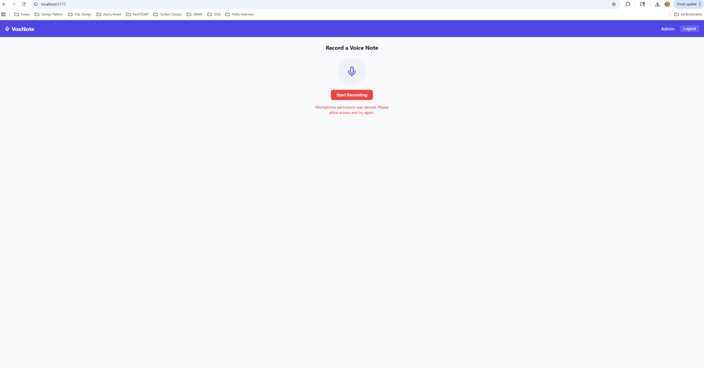

# VoxNote — UI Guide & Screenshots

A visual walkthrough of every screen in the VoxNote application.

---

## Table of Contents

1. [Login / Register](#1-login--register)
2. [Record a Voice Note — Idle State](#2-record-a-voice-note--idle-state)
3. [Record a Voice Note — Recording in Progress](#3-record-a-voice-note--recording-in-progress)
4. [Record a Voice Note — Microphone Permission Denied](#4-record-a-voice-note--microphone-permission-denied)
5. [Review & Edit Transcription Before Saving](#5-review--edit-transcription-before-saving)
6. [Note Saved Successfully](#6-note-saved-successfully)
7. [My Notes — List View](#7-my-notes--list-view)
8. [Admin Dashboard — All Notes Tab](#8-admin-dashboard--all-notes-tab)
9. [Admin Dashboard — Users Tab & User Notes Modal](#9-admin-dashboard--users-tab--user-notes-modal)

---

## 1. Login / Register

<p align="center">
  
</p>

| Element | Description |
|---------|-------------|
| **??? VoxNote** branding | App logo and tagline *"Voice notes, transcribed"* |
| **Login / Register tabs** | Toggle between signing in and creating a new account |
| **Username & Password fields** | Standard credential inputs |
| **Sign In / Create Account button** | Submits the form; label changes based on the active tab |
| **Demo hint** | Shown on the Login tab — `admin / admin123` for quick testing |

**Behavior:**
- Authenticated users are redirected to the **Home** (recording) page.
- Admin users are redirected to the **Admin Dashboard** after login.
- If already logged in, visiting `/login` redirects to Home.

---

## 2. Record a Voice Note — Idle State

<p align="center">
  
</p>

| Element | Description |
|---------|-------------|
| **Navbar** | Purple bar with ??? **VoxNote** on the left; **Admin** link and **Logout** button on the right (Admin link only visible for admin users) |
| **"Record a Voice Note"** heading | Page title |
| **Microphone icon** | Purple/inactive mic inside a circular background |
| **"Start Recording" button** | Red button to begin voice capture |

**Behavior:**
- Clicking **Start Recording** requests microphone permission from the browser.
- If granted, the app transitions to the *Recording in Progress* state.
- If denied, the *Permission Denied* error state is shown.

---

## 3. Record a Voice Note — Recording in Progress

<p align="center">
  
</p>

| Element | Description |
|---------|-------------|
| **Microphone icon** | Turns **red** with a pulsing/glowing animation to indicate active recording |
| **Timer** | Shows elapsed recording time (e.g., `00:08`) |
| **"Stop" button** | Stops the recording and proceeds to the transcription/edit step |

**Behavior:**
- The browser's Web Speech API transcribes audio in real-time (free, no API key).
- The pulsing animation provides clear visual feedback that recording is active.
- Clicking **Stop** ends the recording session and shows the transcribed text in an editable form.

---

## 4. Record a Voice Note — Microphone Permission Denied

<p align="center">
  
</p>

| Element | Description |
|---------|-------------|
| **Microphone icon** | Remains purple/inactive |
| **"Start Recording" button** | Still available for retry |
| **Error message** | Red text: *"Microphone permission was denied. Please allow access and try again."* |

**Behavior:**
- This state appears when the user blocks microphone access in the browser permission prompt.
- The user must update browser permissions and click **Start Recording** again to retry.

---

## 5. Review & Edit Transcription Before Saving

<p align="center">
  
</p>

| Element | Description |
|---------|-------------|
| **Title input** | Editable text field for the note title (e.g., *"For Demo"*). Defaults to empty/untitled. |
| **Content textarea** | Contains the transcribed text (e.g., *"hello I am here so now you can hear me"*). Fully editable — the user can correct or expand the transcription. |
| **"Save Note" button** | Purple button — saves the note to the backend via `POST /api/notes` |
| **"Cancel" button** | Discards the transcription and returns to the idle recording state |

**Behavior:**
- After recording stops, the transcribed text is pre-filled in the textarea.
- The user can edit the title and content before saving.
- On save, the note is persisted to the SQLite database via the .NET API.

---

## 6. Note Saved Successfully

<p align="center">
  
</p>

| Element | Description |
|---------|-------------|
| **Success message** | Green text: *"? Note saved successfully!"* |
| **"Record Another" button** | Purple button — resets the page to the idle recording state for a new note |
| **"View Notes" button** | Navigates to the **My Notes** list view (`/notes`) |

**Behavior:**
- Shown immediately after a successful save.
- Provides clear next-step actions so the user isn't left on a dead-end screen.

---

## 7. My Notes — List View

<p align="center">
  
</p>

| Element | Description |
|---------|-------------|
| **"My Notes" heading** | Page title |
| **Note cards** | Each card shows: **Title** (bold, left), **Date** (right, e.g., *"Apr 1, 2026, 07:36 PM"*), and a **text preview** of the note content |
| **"Edit" button** | Opens the note in an inline editor to update title/content |
| **"Delete" button** | Red text — deletes the note after confirmation |

**Behavior:**
- Notes are displayed in reverse chronological order (newest first).
- Each user only sees their own notes (enforced by the backend via JWT claims).
- Edit triggers a `PUT /api/notes/{id}` call; Delete triggers `DELETE /api/notes/{id}`.

**Example notes shown:**

| Title | Content Preview | Date |
|-------|----------------|------|
| For Demo | hello I am here so now you can hear me | Apr 1, 2026, 07:36 PM |
| Untitled | Hello. Pillow. Pillow. Hello. | Mar 26, 2026, 04:50 PM |
| Untitled | Hello. Can you hear me? | Mar 26, 2026, 03:38 PM |

---

## 8. Admin Dashboard — All Notes Tab

<p align="center">
  
</p>

| Element | Description |
|---------|-------------|
| **"Admin Dashboard" heading** | Page title |
| **Tab bar** | Two tabs: **Users** and **All Notes** (currently active) |
| **Note cards** | Each card shows: **Title**, **Content preview**, **Date**, and **Author** (e.g., *"by admin"*, *"by 789kamlesh890@gmail.com"*) |

**Behavior:**
- Only accessible to users with the **Admin** role (enforced by both frontend route guard and backend `[Authorize(Roles = "Admin")]`).
- Shows **all notes from all users** in a read-only view — admins cannot edit or delete other users' notes.
- The author label helps admins identify which user created each note.

**Example notes shown:**

| Title | Author | Date |
|-------|--------|------|
| For Demo | admin | Apr 1, 2026 |
| Untitled | admin | Mar 26, 2026 |
| General | 789kamlesh890@gmail.com | Mar 26, 2026 |
| Untitled | admin | Mar 26, 2026 |

---

## 9. Admin Dashboard — Users Tab & User Notes Modal

<p align="center">
  
</p>

| Element | Description |
|---------|-------------|
| **Users tab** (active) | Lists all registered users |
| **User cards** | Each shows: **Username/email**, **Role badge** (yellow `ADMIN` or blue `USER`), **Note count**, **Join date**, and a **"View Notes"** button |
| **"View Notes" button** | Opens a modal overlay showing that user's notes |
| **Modal** | Titled *"Notes by {username}"* with a **Close** button. Displays the user's notes as read-only cards with title, content preview, and date. |

**Behavior:**
- The Users tab calls `GET /api/admin/users` to fetch all registered users with note counts.
- Clicking **View Notes** calls `GET /api/admin/users/{userId}/notes` and opens a modal.
- The modal is read-only — admins can view but not modify other users' notes.

**Example users shown:**

| Username | Role | Notes | Joined |
|----------|------|-------|--------|
| 789kamlesh890@gmail.com | USER | 1 note | Mar 26, 2026 |
| admin | ADMIN | 3 notes | Mar 26, 2026 |

**Example modal content (for 789kamlesh890@gmail.com):**

| Title | Content | Date |
|-------|---------|------|
| General | Hey, can you talk to me? | Mar 26, 2026 |

---

## Navigation Flow

```
Login (/login)
  ?
  ??? [User role] ??? Home (/): Record a Voice Note
  ?                       ?
  ?                       ??? Recording ? Stop ? Edit/Save ? Success
  ?                       ?                                     ??? Record Another ? Home
  ?                       ?                                     ??? View Notes ? My Notes
  ?                       ??? Mic Denied ? Retry
  ?
  ??? [User role] ??? My Notes (/notes): List, Edit, Delete
  ?
  ??? [Admin role] ?? Admin Dashboard (/admin)
                          ??? All Notes tab (read-only)
                          ??? Users tab ? View Notes modal (read-only)
```

---

## Common UI Elements

| Element | Location | Description |
|---------|----------|-------------|
| ??? **VoxNote** logo | Navbar (left) | Always visible; links to Home |
| **Admin** link | Navbar (right) | Only visible for Admin users; navigates to `/admin` |
| **Logout** button | Navbar (right) | Clears JWT token from localStorage and redirects to Login |
| **Purple theme** | Throughout | Primary color `#4f46e5` (indigo) used for navbar, buttons, and accents |
